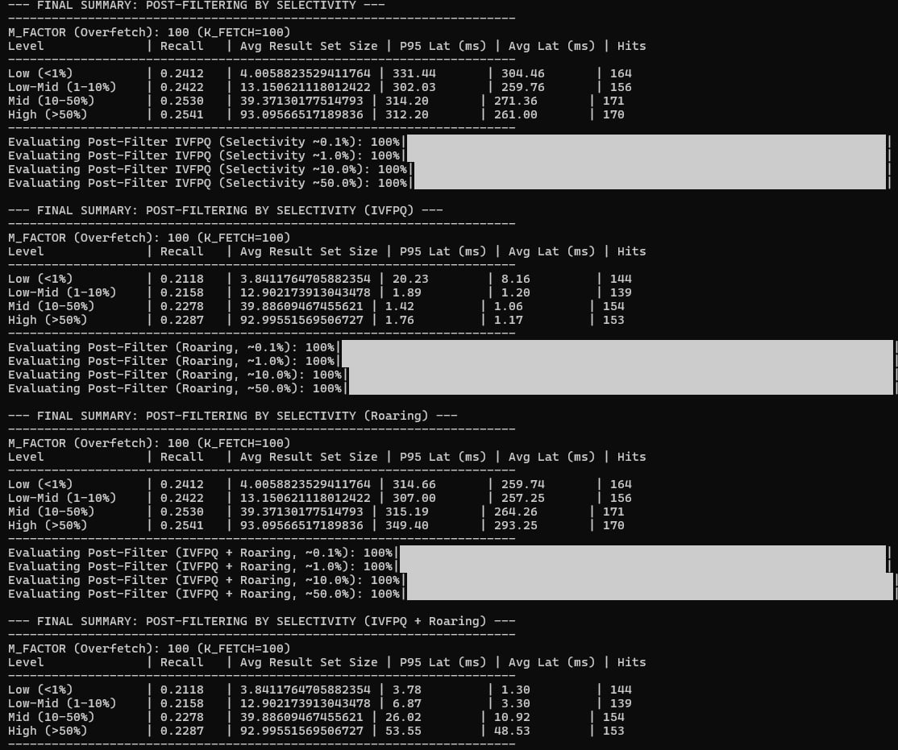
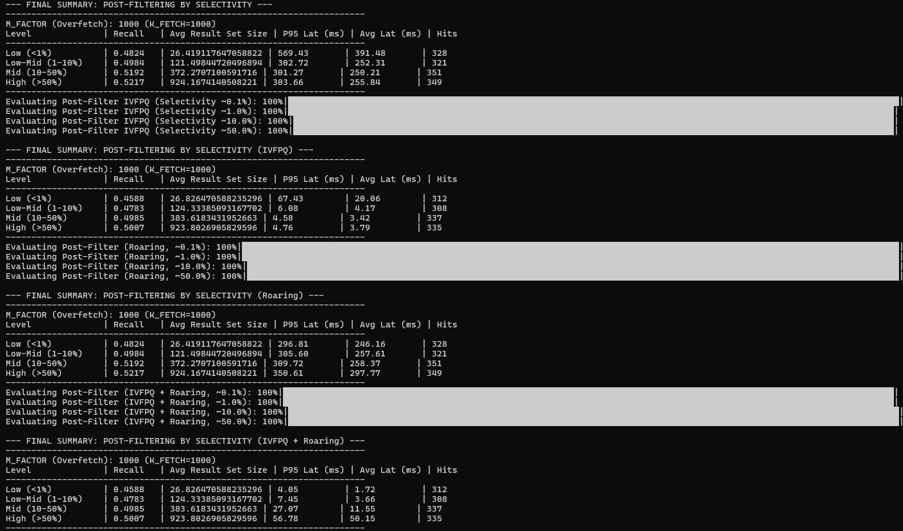

## Build Database

1. Clone the ESCI query data:

```bash
git clone https://github.com/amazon-science/esci-data.git # remember to enable lfs
```

2. Download the review and meta file from [Amazon Reviews'23](https://amazon-reviews-2023.github.io/main.html) by running the following:

```bash
chmod +x download_amz2023.sh
./download_amz2023.sh
```

This will create the raw .jsonl dataset under the directory `./amz2023_raw`. 3. Make sure the necessary python packages are installed

```bash
pip install -r requirements.txt
```

4. Pre-process Amazon Reviews'23, create the .csv data files, and store under the directory `./amz2023_processed`. Then, create the main sqlite database and populate the `products` and `reviews` tables.

```bash
python 1_build_db/process_amazon_reviews.py --input_dir ./amz2023_raw --out_dir ./amz2023_processed
sqlite3 amz.db < 1_build_db/schema.sql
sqlite3 amz.db < 1_build_db/load_amz.txt
```

5. Pre-process the queries data from ESCI and Amazon-C4, create shopping_queries_dataset_small.csv and amz_c4_queries.csv, and store under the directories `./esci-data` and `./1_build_db` respectively. This will populate the `esci_queries` and `amz_c4_queries` tables with only rows whose `product_id` exists as `parent_asin` in the products table, and whose query is in English.

```bash
python 1_build_db/process_queries.py --query_file esci-data/shopping_queries_dataset/shopping_queries_dataset_examples.parquet --db amz.db
python 1_build_db/process_queries.py --query_file McAuley-Lab/Amazon-C4 --db amz.db
sqlite3 amz.db < 1_build_db/load_queries.txt
```

6. Populate the `esci_filters` and `amz_c4_filters` tables with the structured filters to be used during hybrid search. We will only populate rows whose `product_id` exists as `parent_asin` in the products table.

```bash
python 1_build_db/load_filters.py --db amz.db --json 1_build_db/esci_filters.json --table esci_filters
python 1_build_db/load_filters.py --db amz.db --json 1_build_db/amz_c4_filters.json --table amz_c4_filters
```

## Build roaring bitmaps based on the stored structured filters

Directly download bitmaps_esci.pkl using

```bash
curl https://cs6400.s3.ap-northeast-1.amazonaws.com/bitmaps_esci.pkl --out bitmaps_esci.pkl
```

Or generate from the most up-to-date code using

```bash
python build_bitmaps.py --db amz.db --filters_json ./1_build_db/esci_filters.json --out bitmaps_esci.pkl
```

Note that the command above takes ~24mins on a 24-core, 161GB RAM PACE cluster.

## Create the product embeddings using the BLAIR model

Directly download embeddings.parquet using

```bash
curl https://cs6400.s3.ap-northeast-1.amazonaws.com/embeddings.parquet --out embeddings.parquet
```

Embedding generation using embeddings_pipeline.py takes hours, but here is the command:

```bash
python embeddings_pipeline.py --db ./amz.db --out_dir ./embedding_shards --categories Appliances All\ Beauty AMAZON\ FASHION --parquet embeddings.parquet
```

## Running Evaluation

```bash
python main.py --dataset [esci, amazon_c4]
```

## TODO

- Prefiltering (+IVFPQ, Roaring bitmaps)

## Some notes regarding IVFPQ, Roaring Bitmaps, and Baseline evaluation pipeline (Jonathan)

Feel free to delete this from the README after the info needed for code refactoring / report is extracted.

### General

Right now, four methods are being evaluated:

1. Postfilter baseline (Basic index ANN -> SQL filtering)
2. Postfilter w/ IVFPQ (IVFPQ ANN -> SQL filtering)
3. Postfilter w/ Roaring bitmap (Basic index ANN -> Roaring bitmap filtering)
4. IVFPQ + Roaring bitmap pipeline (IVFPQ ANN -> Roaring bitmap filtering)
5. (not added) We should probably add prefiltering back as a baseline between 1 and 2.

- Note: I personally think it doesn't make sense to use IVFPQ combined with a prefiltering method, i.e. no SQL filtering -> IVFPQ ANN or Roaring bitmap filtering -> IVFPQ ANN, due to the need to rebuild the IVFPQ index over the filtered items (building is relatively costly, and amortized into query time is still pretty bad). This note might not need to be listed in the report, idk.
- IVFPQ: I think the IVFPQ parameters / implementation follow the midterm report or normal usage quite well. Not too much to add except for parameters.
- Roaring bitmaps: Assumes knowledge of filters but not query set items. The way we actually do this is pull all filters from esci_filters_deduplicated.json, and add each filter as a key. For each key, the corresponding value is a representation of product ids (within all of amz.db) that satsify that filter. During evaluation, a filter query is then done by directly pulling the product ids from said representation / bitmap. Note that "knowledge of filters" is quite a strong assumption and this is more a theoretical analysis on what we could do if we knew "all" the hot filter ranges or values (not dealing with fall back to SQL queries on a "missing" filter). Realistically, we would build Roaring bitmaps to save key ranges for numerical fields / hot text queries, and use roaring bitmaps to remove certain elements from the potential set and follow this up with a SQL filter on a smaller set. However, we are trying to analyze the effects of pushing the assumption to the limit and seeing how this effects latency.

### File functionality:

- main.py: driver that bundles the methods in search.py to evaluate
- search.py: bulk of the four hybrid query methods' logic
- roaring bitmap related:
  - bitmap_keys.py: defines a canonical string key format for predicates (column, op, value)
  - build_bitmaps.py: offline step - driver that builds bitmaps.pkl
  - roaring_index.py: online step - bitmap lookup

### Results on local machine / discussion

The final results put in the report should be taken from the formal evaluation, but I think the trends and important points will likely be similar.

- Results: fetch 100
  
- Results: fetch 1000
  
- Prefilter has high recall but large latency (as expected and demonstrated in the midterm checkpoint).
- Recall / latency tradeoff observed between using IVFPQ vs Flat index. This is new compared to the midterm checkpoint, but expected. The recall drops off because IVFPQ essentially indexes and runs ANN on a compressed version of the embedding vectors. This same reasoning explains the increase in speed.
- The recall is identical from using roaring bitmaps versus SQL filter as expected. Logically, these two do the same thing, except the roaring bitmap is like an "inverse", saving ids against filter values rather than filtering on SQL table values in ranges / equivalence / substrings.
- Interesting pattern where for fine selectivity (~0.1%), Roaring outperforms SQL filters, but for higher selectivity it either is roughly equal or worse in latency. I think this is because of the fact that though "getting the bitmap from the key corresponding to the filter" takes the same time for any given filter, "getting the elements from the bitmap" takes longer for bitmaps containing more ids. Hence the latency is positively correlated to the number of ids allowed by the filter.
- It makes sense to run prefiltering if we want high recall and don't care about latency. Run IVFPQ ANN + SQL filtering if we want speed at coarse selectivity, and run IVFPQ ANN + Roaring Bitmap filtering at fine selectivity. (Might want to unify the wording for selectivity levels.)

### Potential TODOs during code refactoring / formal evaluation

- Add prefilter evaluation back into main and search.py
- Refactor main.py to take arguments and tune overfetch parameters individually (optional, only if you want to do it)
- Time / evaluate everything once on PACE or consistent env
  - Evaluate the five methods in "General" with overfetch 100 and 1000 respectively
  - Time building the roaring bitmaps along with the ANN indexes
